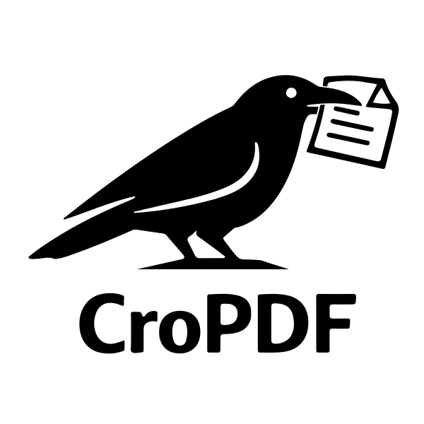

# CroPDF


> **Lightweight PDF cropper that keeps vector quality** — extract figures from textbooks for Typst, LaTeX, or any document.

[](LICENSE)
[](https://python.org)
[]()


<p align="center">
   
</p>


## Why I Made This

I write my math notes in [Typst](https://typst.app) and often want to include figures from textbooks (which I have as PDFs). To preserve the best possible quality (sharp text, scalable diagrams, no compression artifacts) I need to **crop the original PDF and keep it in PDF format**.

Yes, some PDF viewers can do this. But I wanted something:
- **Lightweight** — no bloated software, just a simple tool
- **Fast** — open, crop, save, done
- **Lossless** — true vector output, not a rasterized screenshot

So I built CroPDF: ~280 lines of Python, one dependency, does one thing well.

## Features

- 📄 **Vector-quality output** — crops PDFs without rasterization
- 🖱️ **Visual selection** — draw a rectangle to define the crop area  
- ⌨️ **Pixel-perfect adjustment** — fine-tune with arrow keys
- 📖 **Page navigation** — browse multi-page PDFs easily
- 💻 **CLI launch options** — convenient command-line usage
- 🪶 **Minimal footprint** — just PyMuPDF


## Installation

### Prerequisites

**Python 3.8+** is required. Install if needed:
- **macOS**: `brew install python` (or download from [python.org](https://python.org))
- **Windows**: Download from [python.org](https://python.org)
- **Linux**: Usually pre-installed, or `sudo apt install python3`

**uv** (recommended) — fast Python package installer:
```bash
curl -LsSf https://astral.sh/uv/install.sh | sh
```
Or see [uv installation docs](https://docs.astral.sh/uv/getting-started/installation/).

### Quick Install (recommended)

```bash
uv tool install git+https://github.com/ericceg/CroPDF.git
```

Then run from anywhere:
```bash
cropdf
```

### With pip

```bash
pip install git+https://github.com/ericceg/CroPDF.git
```

### From Source

```bash
git clone https://github.com/ericceg/CroPDF.git
cd CroPDF
uv tool install .
# or: pip install .
```


## Usage

```bash
cropdf
```

Or open a file directly:
```bash
cropdf path/to/file.pdf
```

Or open a file and jump to a page immediately (1-based):
```bash
cropdf path/to/file.pdf --page 12
```

1. Run `cropdf` (or `cropdf path/to/file.pdf`)
2. Navigate to the page with the figure you want
3. **Click and drag** to draw a crop rectangle
4. Fine-tune the selection:
   - **Arrow keys** — move the rectangle (1px)
   - **Shift + Arrow** — resize the rectangle
   - **Space + Arrow** — move/resize by 25px
5. Click **Crop and Save** → choose output location

The output is a proper PDF — scalable, searchable, perfect for embedding.


## Keyboard Shortcuts

| Shortcut | Action |
|----------|--------|
| `⌘O` / `Ctrl+O` | Open PDF file |
| `⌘S` / `Ctrl+S` | Crop and save |
| `⌘G` / `Ctrl+G` | Go to page |
| `←` `→` | Navigate pages (when no selection) |
| `Arrow keys` | Move selection (1px) |
| `Shift + Arrow` | Resize selection |
| `Space + Arrow` | Move/resize by 25px |
| `Escape` | Deselect area |


## Use Cases

- 📚 Extract figures from textbooks for your notes
- 📝 Include diagrams in Typst/LaTeX documents
- 🎓 Crop theorems or examples for presentations
- 📊 Pull charts from papers for slides


## Requirements

- Python 3.8+
- tkinter (GUI library)

**Note:** tkinter is included with most Python installations. If you get `ModuleNotFoundError: No module named '_tkinter'`:

- **macOS (Homebrew)**: `brew install python-tk`
- **Ubuntu/Debian**: `sudo apt-get install python3-tk`
- **Windows**: tkinter is included by default


## License

MIT — see [LICENSE](LICENSE)
